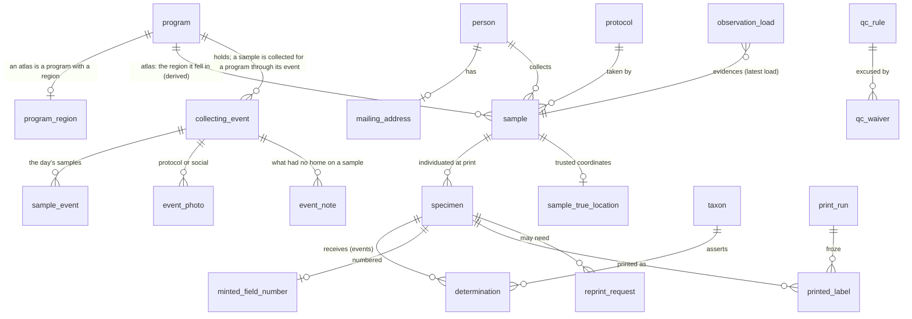

# Schema sketch

> **Status:** the runnable schema lives in [`schema/*.sql`](../schema/) and deliberately covers **less** than this sketch — only what the current roadmap phase needs. Entities sketched here but not yet built — email/mailing addresses, QC waivers, print runs, `minted_field_number` — get re-reviewed against this sketch when their phase arrives. iNat sync history (`sync_run`/`observation_load`, phase 3) and corrections (phase 4) are built now, the latter as load-anchored events per [ADR 0004](adr/0004-correction-overlay.md) rather than this sketch's stored-old-value shape. Naming has also evolved in the implementation: `taxon` → `animal` (the curated taxonomy covers the animal side — specimens and bycatch — while floral hosts are iNat taxon references), `name` → `scientific_name`, and identity follows ADR 0002: entity tables have an `entity_id` PK from the single global `entity_id_seq`; 1:1 facet tables are keyed by their parent. Coordinates were restructured away from this sketch's iNat-inherited shape: the sample layer holds only **believed-true** coordinates (`sample_location`, with a `source` saying why we believe them, and elevation as a property of those coordinates); deliberately-shifted geoprivacy pairs never enter it, remaining verbatim in the staging/observation layer. `sample.latitude`-as-published and `sample_true_location` below are superseded by that shape. Two places the implementation covers **more** than this sketch: `determination` carries a `qualifier` (`cf.`/`aff.`/`nr.`, the open-nomenclature terms that modify a species assertion) and a `verbatim_identification` beside the node it resolved to (beeline-tgu); and `sample_location` records the coordinates an elevation was derived from, so "still about this point" is a question the store can answer rather than a rule every coordinate writer has to remember (beeline-x5c, `schema/170_views_elevation.sql`).

A first concrete rendering of the domain model, for discussion — not an implementation. Vocabulary follows [CONTEXT.md](../CONTEXT.md); the requirements it answers are in [reference-implementation.md](reference-implementation.md). SQL is dialect-neutral where possible; places where the DuckDB-vs-PostgreSQL choice actually bites are called out. Trap-related tables are provisional pending the [staff questions](questions.md).

The design follows three commitments made so far:

1. **Events over current values** where humans assert things: determinations, waivers, corrections, print runs are append-only records of who did what when.
2. **Derived over stored** where facts follow from data: QC findings, printability, determination-of-record are views, never columns.
3. **Decisions snapshot what they saw**: a print run stores the label content and findings it acted on, so later data changes can't rewrite what physically happened.

## Overview



## People and programs

```sql
-- Deliberately anemic: a person is an identity to hang facts on. "Person" (like "user")
-- is the classic god-table smell; every concern lives in its own satellite table with
-- its own privacy and lifecycle, and joining one in is always a deliberate act.
CREATE TABLE person (
  id           INTEGER PRIMARY KEY,
  display_name TEXT NOT NULL
);

-- A person exists before (or without) an iNat account.
CREATE TABLE inat_account (
  person_id    INTEGER PRIMARY KEY REFERENCES person(id),
  inat_user_id BIGINT NOT NULL UNIQUE,   -- the stable key; logins change
  login        TEXT NOT NULL             -- cached for display and matching, refreshed on sync
);

-- Private, like mailing_address: its own table, no accidental joins.
CREATE TABLE email_address (
  person_id  INTEGER PRIMARY KEY REFERENCES person(id),
  email      TEXT NOT NULL,
  bounced_at TIMESTAMP                   -- deliverability: null = believed deliverable
);

-- The other truly private datum. Readable only by the label-printing side;
-- writable by its owner. Every atlas collector SHOULD have one, since their labels are
-- mailed to them; not every person, and not necessarily a BLM collector, whose labels
-- may go to whoever pins for that program instead. So it is a gate on printing rather
-- than a column on person: a sample whose labels have no destination — no address for
-- the primary collector and no label destination for the program — is not pending
-- (Peter, 2026-09-24; where BLM labels go is questions.md, BLM 2).
CREATE TABLE mailing_address (
  person_id  INTEGER PRIMARY KEY REFERENCES person(id),
  address    TEXT NOT NULL,
  updated_at TIMESTAMP NOT NULL
);

-- A program governs what is collected through it (CONTEXT: Program, Governor). There is
-- no atlas table: an ATLAS IS A PROGRAM WITH A REGION — the row in program_region is what
-- makes it one — and everything that used to hang off `atlas` hangs off program: the
-- code, the mark, who prints, membership, the sample's atlas. Master Melittology and the
-- BLM surveys are the rows with no region.
CREATE TABLE program (
  id                 INTEGER PRIMARY KEY,
  code               TEXT UNIQUE NOT NULL,       -- 'OBA', 'WaBA', 'BC', 'ID', 'NM', 'OK', 'MM', 'BLM'
  name               TEXT NOT NULL,
  slug               TEXT UNIQUE NOT NULL,       -- its content page on the site, possibly with subpages
  prints_labels      BOOLEAN NOT NULL DEFAULT false,  -- built as the atlas_printing satellite (schema/010)
  governor_person_id INTEGER REFERENCES person(id)    -- who decides what leaves it
);
-- The region is what an atlas has and the other programs do not. Geographic assignment
-- then costs nothing: iNat stamps observations with place_ids, so "sample fell in atlas
-- A" ≈ A.inat_place_id ∈ observation place_ids; ambiguous or out-of-region samples get
-- explicit assignment (sample_atlas.assigned_by, built). A program's page, /programs/<slug>,
-- possibly with subpages — what it is, how to take part, its protocols — is content, not
-- records; the model holds only the slug. The catch-all — Master Melittology itself,
-- which a sample outside every region is collected for — is known today only by its iNat
-- project's name, "Master Melittologist (outside of Oregon)", and is due a name of its
-- own (Peter, 2026-09-24).
CREATE TABLE program_region (
  program_id    INTEGER PRIMARY KEY REFERENCES program(id),
  inat_place_id BIGINT UNIQUE NOT NULL         -- e.g. Washington = place 46
);
-- Membership (built: person_membership, kind 'atlas' | 'program') becomes a program_id,
-- with "atlas or the program itself" read off whether that program has a region.
```

## Programs, protocols and collecting events

Sketched 2026-09-24 from the BLM conversations ([CONTEXT.md](../CONTEXT.md): Collecting event, Outing, Protocol, Programs and governance; [questions.md](questions.md), BLM surveys). Minimal on purpose: it says how the three concepts relate to each other and to `sample`, and no more. Weather, habitat and the plot's floral list are on Olivia's Kobo form and are not sketched until the form has been seen.

`program` and `program_region` are defined under People and programs above; this section adds what hangs off them.

```sql
-- Which program a sample was collected FOR is derived, in order of evidence: the event
-- it belongs to, stated by whoever recorded it; else the atlas it fell in; else the
-- catch-all, Master Melittology itself (Peter, 2026-09-24). A view, never a table — the
-- table version said the event's fact a second time — and its atlas stays a separate
-- fact in sample_atlas, since a BLM sample inside New Mexico is both.
CREATE VIEW sample_program AS
SELECT s.id AS sample_id,
       coalesce(e.program_id, sa.atlas_id, (SELECT id FROM program WHERE code = 'MM')) AS program_id
FROM sample s
LEFT JOIN sample_event se ON se.sample_id = s.id
LEFT JOIN collecting_event e ON e.id = se.event_id
LEFT JOIN sample_atlas sa ON sa.sample_id = s.id;   -- built (schema/010); atlas_id is a program with a region

-- How a sample was taken: shared reference data, like animal_rank, never free text and
-- owned by no program — every atlas uses the same net protocol, or nearly the same, and
-- a "nearly" is its own row. A row says what the protocol FIXES, so effort is never
-- smuggled into a string. grain='event' rows are a day's shape (the BLM plot day),
-- composed of sample protocols; their sample-level columns are NULL.
CREATE TABLE protocol (
  id               INTEGER PRIMARY KEY,
  code             TEXT UNIQUE NOT NULL,   -- 'net', 'trap', 'net-10min', 'pan-6h', 'plot-day'
  name             TEXT NOT NULL,
  grain            TEXT NOT NULL CHECK (grain IN ('sample', 'event')),
  method           TEXT CHECK (method IN ('net', 'pan trap', 'vane trap', 'nest block')),
  duration_minutes INTEGER,                -- fixed by the protocol: 10, 360; NULL = not fixed
  records_times    BOOLEAN,                -- start and end are recorded, not assumed
  host_per_sample  BOOLEAN,                -- one floral host per sample (one vial per plant)
  zero_is_record   BOOLEAN,                -- a session with no bees is still a record
  label_host       BOOLEAN,                -- the host prints on the label
  label_time       BOOLEAN                 -- the collection time prints on the label
);
-- sample gains: protocol_id INTEGER REFERENCES protocol(id), time_start TIME, time_end TIME.
-- The legacy protocol strings ("6 Vane Traps") map onto protocol rows by curation and
-- stay verbatim beside them; they never constrain the table.

-- A program's day at a place. Named, usually scheduled, created before, during or after
-- the day. The name is a label and never a key; identity is the program, the place and
-- the dates. An outing (one person's road trip) is deliberately not here.
CREATE TABLE collecting_event (
  id          INTEGER PRIMARY KEY,
  program_id  INTEGER NOT NULL REFERENCES program(id),
  kind        TEXT NOT NULL CHECK (kind IN ('collecting', 'training')),
  name        TEXT NOT NULL,                     -- 'Cottonwood Canyon, 12 Jun 2027'
  protocol_id INTEGER REFERENCES protocol(id),   -- an event-grain protocol, or NULL
  property    TEXT,                              -- 'Cottonwood Canyon State Park'
  site_code   TEXT,                              -- 'EMPP1': opaque, not unique (CONTEXT: Site code)
  latitude    DOUBLE,
  longitude   DOUBLE,
  date_start  DATE NOT NULL,
  date_end    DATE NOT NULL,
  created_by  INTEGER NOT NULL REFERENCES person(id),
  created_at  TIMESTAMP NOT NULL
);
CREATE TABLE event_attendance (
  event_id  INTEGER NOT NULL REFERENCES collecting_event(id),
  person_id INTEGER NOT NULL REFERENCES person(id),
  PRIMARY KEY (event_id, person_id)
);

-- A sample belongs to at most one event; no row = none, as with sample_atlas. A legacy
-- sample joins an event a person creates for it; none is minted from the legacy records.
CREATE TABLE sample_event (
  sample_id INTEGER PRIMARY KEY REFERENCES sample(id),
  event_id  INTEGER NOT NULL REFERENCES collecting_event(id)
);

-- Photos and notes hold what has no home on a sample. The bytes live in an object store
-- chosen before this is built; the row holds the key. A protocol photo is evidence and
-- carries the rare-plant question; a social photo carries faces.
CREATE TABLE event_photo (
  id         INTEGER PRIMARY KEY,
  event_id   INTEGER NOT NULL REFERENCES collecting_event(id),
  kind       TEXT NOT NULL CHECK (kind IN ('protocol', 'social')),
  object_key TEXT NOT NULL,
  taken_at   TIMESTAMP,
  taken_by   INTEGER REFERENCES person(id),
  caption    TEXT
);
CREATE TABLE event_note (
  id        INTEGER PRIMARY KEY,
  event_id  INTEGER NOT NULL REFERENCES collecting_event(id),
  author_id INTEGER NOT NULL REFERENCES person(id),
  noted_at  TIMESTAMP NOT NULL,
  body      TEXT NOT NULL                        -- access, phenology, what was learned
);
-- Later, maybe: event_track (event_id, person_id, object_key) for a GPS track, the one
-- thing an outing holds that a sample cannot. Belongs to whoever walked it.
```

### Worked example: a BLM plot day

Two people survey plot `EMPP1` on 2027-06-12, pan traps out 08:45 to 14:45 and two net sessions between. The event is created the evening before from the Kobo form's schedule; the samples arrive with the day's submissions and are edited in Beeline from then on.

| Table | Row |
| --- | --- |
| `program` | `BLM`, "BLM bee surveys", governor: Olivia |
| `protocol` | `plot-day` (grain event); `pan-6h` (sample, pan trap, 360 min, times recorded, zero is a record); `net-10min` (sample, net, 10 min, times recorded, host per sample, zero is a record, host and time on the label) |
| `collecting_event` | program `BLM`, kind collecting, "EMPP1, 12 Jun 2027", protocol `plot-day`, site code `EMPP1`, 2027-06-12 to 2027-06-12 |
| `event_attendance` | Olivia; a contractor |
| `sample` × 4 | one pan-trap sample, `pan-6h`, 08:45–14:45, 61 specimens; three net samples, `net-10min`, one vial per plant, 09:20 *Penstemon*, 09:35 *Eriogonum* (0 specimens, still a record), 13:10 *Cleome* |
| `sample_event` × 4 | all four on the one event, which is what makes them BLM samples |
| `sample_atlas` × 4 | `NM`, derived from where the plot is — not written by anything here |
| `event_photo` | two protocol photos (the plot, the *Penstemon* stand); one social photo of the pair at the truck |
| `event_note` | "Gate on the county road locked; combination from the field office. *Eriogonum* just opening." |

The pan-trap sample and the net samples are distinct samples within one event, and the trap sample's specimens carry the six-hour window, not a day. Nothing here decides which of the two collectors' Kobo submissions is the record (questions.md, 17).

### Worked example: an atlas event with legacy samples

A Washington Bee Atlas collecting day at a state park on 2024-05-18, recorded in 2027 because the group photo had nowhere to go.

| Table | Row |
| --- | --- |
| `collecting_event` | program `WaBA`, kind collecting, "Cottonwood Canyon, 18 May 2024", no protocol, property "Cottonwood Canyon State Park", created 2027-03-02 by the coordinator |
| `event_attendance` | the six people whose samples are attached, plus two who collected nothing |
| `sample_event` | eleven legacy samples from that date and place, attached by hand; their `sample_number`s are untouched and still run per collector per day |
| `sample_program` (view) | `WaBA`, through the event; before the event existed it was `WaBA` through the atlas they fell in, so attaching them changed nothing here. A legacy sample outside every atlas resolves to the catch-all |
| `event_photo` | one social photo |
| `event_note` | "Balsamroot past peak by mid-May here; a week earlier next year." |

A training event is the same row with kind `training`, attendance, and no samples.

## Curated taxonomy

```sql
CREATE TABLE taxon (
  id         INTEGER PRIMARY KEY,
  parent_id  INTEGER REFERENCES taxon(id),
  rank       TEXT NOT NULL,   -- must include suborder & superfamily (Symphyta, Ichneumonoidea)
  name       TEXT NOT NULL,
  authorship TEXT
);
```

Bees to species; non-bee scaffold deep enough for wasps at species rank (seeded on demand from ITIS, the program's basis for bees and bycatch alike — beeline-45v). *Open: versioning mechanics — likely git-versioned seed data plus an append-only `taxon_change` log; decide when the curation workflow (Lincoln et al.) is designed.* Floral hosts do **not** live here — they are iNat taxon references on the sample.

## Ingestion (observation history)

```sql
-- One execution of a fetch over one source+window. Incomplete runs write no loads;
-- unauthenticated runs abort — never silently anonymous.
CREATE TABLE sync_run (
  id            INTEGER PRIMARY KEY,
  source        TEXT NOT NULL,            -- iNat project id (provenance only, never assignment)
  window_start  DATE,
  window_end    DATE,
  started_at    TIMESTAMP NOT NULL,
  completed_at  TIMESTAMP                 -- null ⇒ failed; nothing persisted
);

-- Append-only: a new row only when the whitelisted projection's hash changes.
-- The pipeline is a pure transform over these rows — that's what makes it re-runnable.
CREATE TABLE observation_load (
  id           INTEGER PRIMARY KEY,
  inat_id      BIGINT NOT NULL,
  sync_run_id  INTEGER NOT NULL REFERENCES sync_run(id),
  fetched_at   TIMESTAMP NOT NULL,
  content      JSON NOT NULL,             -- whitelisted projection, not the raw response
  content_hash TEXT NOT NULL
);
-- Current state of an observation = its latest load (a view).
-- Deletion detection: absent from a *complete* run that should have covered it.
```

## Samples and specimens

Nullability here is a stance, not an accident. **Identity fields are NOT NULL**: a record without a collector, date, and sample number isn't identifiable as a sample — an observation missing those stays at the observation stage (with a QC finding) until fixed. **Descriptive fields are nullable because completeness is QC's job**: incomplete data must be storable to be fixable in-app, and the QC rules — not the schema — define "complete enough to print." Host is nullable for the genuine no-host case; atlas until assignment.

```sql
CREATE TABLE sample (
  id                 INTEGER PRIMARY KEY,
  kind               TEXT NOT NULL,       -- 'net' | 'trap'
  collector_id       INTEGER NOT NULL REFERENCES person(id),
  -- atlas: the built shape is the sample_atlas satellite (schema/010, beeline-6e9), whose
  -- atlas_id is a program with a region and whose assigned_by is null ⇒ by geography
  sample_number      TEXT NOT NULL,       -- '3' (net: per collector per day) | 'OBAS-00657' (trap series)
  date_start         DATE NOT NULL,
  date_end           DATE NOT NULL,       -- = date_start for net; range for trap
  specimen_count     INTEGER NOT NULL DEFAULT 0,     -- the working count: free to move until printing
  inat_observation_id BIGINT,             -- evidence link, when iNat-documented
  host_inat_taxon_id BIGINT,              -- iNat taxonomy, by role (see CONTEXT)
  host_name_as_observed TEXT,
  -- Coordinates as iNat publishes them: possibly shifted by geoprivacy.
  -- True coordinates live in sample_true_location; both are kept (see below).
  latitude           DOUBLE,
  longitude          DOUBLE,
  coordinate_uncertainty_m INTEGER,
  geoprivacy         TEXT,                -- null | 'obscured' | 'private', user- or taxon-driven
  country TEXT, state_province TEXT, county TEXT, locality TEXT,
  elevation_m        INTEGER,
  protocol           TEXT,                -- legacy free text; becomes protocol_id → protocol (shared reference data, above)
  sampling_effort    TEXT                 -- trap-count × trap-days etc. TBD (Q6)
);

-- Specimens are individuated by printing. Until a print run freezes, a sample has only
-- a specimen_count, free to move up or down (count corrections, trap batches). Creating
-- a print run creates the specimen rows it prints, mints their numbers, and snapshots
-- their labels. Historical ingestion also lands here — production is 99.9997% printed.
CREATE TABLE specimen (
  id              INTEGER PRIMARY KEY,
  sample_id       INTEGER NOT NULL REFERENCES sample(id),
  specimen_number INTEGER NOT NULL,       -- 1..N within the sample at freeze time
  field_number    TEXT,                   -- opaque verbatim text: all four historical eras land here
  created_at      TIMESTAMP NOT NULL,
  UNIQUE (sample_id, specimen_number)
);

-- True coordinates from trusted authenticated reads, isolated like mailing_address:
-- joining them in is a deliberate act, never an accident. Both pairs are always
-- retained. Whether an atlas may *reveal* them for taxon-obscured records (labels,
-- app, exports) is a per-atlas policy/regulatory question — open, and a blocker
-- before go-live (see questions.md).
CREATE TABLE sample_true_location (
  sample_id  INTEGER PRIMARY KEY REFERENCES sample(id),
  latitude   DOUBLE NOT NULL,
  longitude  DOUBLE NOT NULL
);
```

Consequences worth naming: before printing, QC and self-service operate at the **sample** level (there are no specimen rows to flag); a count *decrease* before printing is just an edit, and only after printing becomes a finding (printed specimens vs current count). A canceled print run's numbers stay burned — sequence gaps are harmless, reuse never is.

**No global UNIQUE on `specimen.field_number`** — history forbids it (`25051768` exists twice on paper). Instead, uniqueness is a hard guarantee only for what Beeline itself mints:

```sql
-- The governed sequence. Insert here *is* the mint; the PRIMARY KEY is the guarantee.
CREATE TABLE minted_field_number (
  field_number   TEXT PRIMARY KEY,
  specimen_id    INTEGER NOT NULL UNIQUE REFERENCES specimen(id),
  minted_at      TIMESTAMP NOT NULL
);
```

Legacy numbers are attributes; minted numbers are governed. (This sidesteps needing partial unique indexes, which PostgreSQL has and DuckDB lacks — the two-table shape is dialect-neutral.)

A specimen-count *decrease* upstream doesn't delete specimen rows; it surfaces as a derived QC finding (specimen rows vs latest observation count).

## Determinations (events)

```sql
CREATE TABLE determination (
  id              INTEGER PRIMARY KEY,
  specimen_id     INTEGER NOT NULL REFERENCES specimen(id),
  taxon_id        INTEGER NOT NULL REFERENCES taxon(id),
  sex             TEXT,
  caste           TEXT,
  determiner_id   INTEGER REFERENCES person(id),
  determiner_name TEXT,                 -- imports name people we may not resolve
  is_expert       BOOLEAN NOT NULL,
  channel         TEXT NOT NULL,        -- 'in_app' | 'ecdysis_import' | ...
  determined_on   DATE,                 -- when made, if known
  recorded_at     TIMESTAMP NOT NULL,   -- when it crossed into Beeline (drives notifications)
  notes           TEXT
);
-- determination_of_record: a VIEW. Provisional rule: latest expert determination wins;
-- else latest volunteer determination. To confirm with staff.
```

Append-only: a correction is a newer event, never an edit. The volunteer draft/commit boundary lives in the app, not here — only deliberate assertions become rows.

## Quality control

Rule *definitions* are SQL views, one per rule, each producing `(specimen_id or sample_id, rule_name, details)`; `qc_finding` is their UNION — derived, never stored. Rule *metadata* is data:

```sql
CREATE TABLE qc_rule (
  name         TEXT PRIMARY KEY,
  severity     TEXT NOT NULL,            -- 'blocking' | 'warning'
  waivable     BOOLEAN NOT NULL,
  instructions TEXT NOT NULL             -- the self-service "what to do" copy
);

CREATE TABLE qc_waiver (
  id           INTEGER PRIMARY KEY,
  rule_name    TEXT NOT NULL REFERENCES qc_rule(name),
  specimen_id  INTEGER REFERENCES specimen(id),
  sample_id    INTEGER REFERENCES sample(id),
  excused_hash TEXT NOT NULL,            -- hash of the flagged values; waiver lapses if they change
  author_id    INTEGER NOT NULL REFERENCES person(id),
  note         TEXT,
  created_at   TIMESTAMP NOT NULL
);
```

**Printability** (view, over *samples*): all label-required fields present ∧ no blocking finding without a live waiver ∧ obscured samples have a `sample_true_location` row (and, once atlases answer the geoprivacy question, that atlas's policy permits printing it for taxon-obscured records) ∧ `specimen_count > 0`. A print run freezes printable samples into specimens.

## Corrections

One shape for volunteer self-fixes, staff overrides, and accepted machine-proposed rewrites — differing only in author and kind:

```sql
CREATE TABLE correction (
  id         INTEGER PRIMARY KEY,
  entity     TEXT NOT NULL,              -- 'sample' | 'specimen' | 'person'
  entity_id  INTEGER NOT NULL,
  field      TEXT NOT NULL,
  old_value  TEXT,
  new_value  TEXT,
  author_id  INTEGER NOT NULL REFERENCES person(id),
  kind       TEXT NOT NULL,              -- 'self_fix' | 'staff_override' | 'machine_proposed'
  reason     TEXT,
  created_at TIMESTAMP NOT NULL
);
```

*Design point resolved by [ADR 0004](adr/0004-correction-overlay.md):* corrections are a three-way-merge overlay anchored on the load the corrector saw (that load is the base). Upstream unchanged → correction applies; upstream converged → correction auto-retires; both moved → the correction stands and a `correction_conflict` finding opens. Conflicts resolve only by a new correction based on the current load.

## Label governance

Built (beeline-1kb.2, 2026-09-17): [schema/035_print_runs.sql](../schema/035_print_runs.sql) holds `print_run`, `minted_field_number` and `printed_label`, and [schema/155_views_print_run.sql](../schema/155_views_print_run.sql) says what they mean. Two things the sketch had here were superseded before they were built, both by [ADR 0008](adr/0008-specimen-identity.md): the run's `state` column is derived from its timestamps instead, and the registry is one row per *number* rather than 1:1 with the specimen, so a duplicate repair can mint a second number without losing the first. `reprint_request` is still to come (beeline-1kb.5), and `printed_label`'s `(print_run_id, specimen_id)` key is the room left for it. Proofing pulls (beeline-1kb.3) and the artifact-lifecycle theme are open; the field-number half of that theme is decided by the ADR (nothing is voided; a superseded number is a non-current registry row).

## Deliberately absent, for now

- **Trap sites / deployments / servicing** — sketched only as `sample.kind='trap'` + series numbers until the staff questions come back. The entities are coming; guessing their shape now would just be wrong.
- **Roles/permissions** — high-trust environment; `atlas_printing` (built, schema/010: a row means the atlas prints its own labels) plus a person↔atlas staff link when a need appears.
- **Administration** — *who staffs* a person, as distinct from where they belong. `person_membership` records membership only (beeline-lcl); program-only volunteers are supported by OBA staff, and until a second administering body exists there is nothing for the model to tell apart. Arrives with the staff link above, not before.
- **Notifications/feed** — derivable from `determination.recorded_at` and print-run events when that scope opens.
- **Ecdysis/GBIF export tables** — exports consume the model; they shouldn't shape it. (Ecdysis is Washington's repository integration, not core.)
