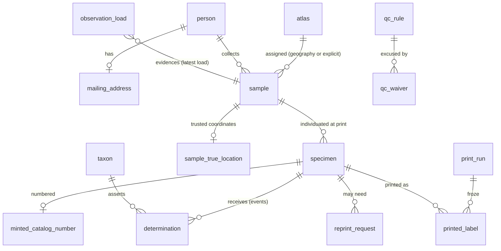

# Schema sketch

A first concrete rendering of the domain model, for discussion — not an implementation. Vocabulary follows [CONTEXT.md](../CONTEXT.md); the requirements it answers are in [reference-implementation.md](reference-implementation.md). SQL is dialect-neutral where possible; places where the DuckDB-vs-PostgreSQL choice actually bites are called out. Trap-related tables are provisional pending the [staff questions](questions.md).

The design follows three commitments made so far:

1. **Events over current values** where humans assert things: determinations, waivers, corrections, print runs are append-only records of who did what when.
2. **Derived over stored** where facts follow from data: QC findings, printability, determination-of-record are views, never columns.
3. **Decisions snapshot what they saw**: a print run stores the label content and findings it acted on, so later data changes can't rewrite what physically happened.

## Overview



## People and atlases

```sql
-- Deliberately anemic: a person is an identity to hang facts on. "Person" (like "user")
-- is the classic god-table smell; every concern lives in its own satellite table with
-- its own privacy and lifecycle, and joining one in is always a deliberate act.
CREATE TABLE person (
  id           INTEGER PRIMARY KEY,
  display_name TEXT NOT NULL
);

-- A person exists before (or without) an iNat account.
CREATE TABLE inat_account (
  person_id    INTEGER PRIMARY KEY REFERENCES person(id),
  inat_user_id BIGINT NOT NULL UNIQUE,   -- the stable key; logins change
  login        TEXT NOT NULL             -- cached for display and matching, refreshed on sync
);

-- Private, like mailing_address: its own table, no accidental joins.
CREATE TABLE email_address (
  person_id  INTEGER PRIMARY KEY REFERENCES person(id),
  email      TEXT NOT NULL,
  bounced_at TIMESTAMP                   -- deliverability: null = believed deliverable
);

-- The other truly private datum. Readable only by the label-printing side;
-- writable by its owner.
CREATE TABLE mailing_address (
  person_id  INTEGER PRIMARY KEY REFERENCES person(id),
  address    TEXT NOT NULL,
  updated_at TIMESTAMP NOT NULL
);

CREATE TABLE atlas (
  id            INTEGER PRIMARY KEY,
  code          TEXT UNIQUE NOT NULL,     -- 'OBA', 'WaBA', 'BC', 'ID', 'NM', 'OK'
  name          TEXT NOT NULL,
  inat_place_id BIGINT UNIQUE,            -- e.g. Washington = place 46
  prints_labels BOOLEAN NOT NULL DEFAULT false
);
-- Geographic assignment costs nothing: iNat already stamps observations with place_ids,
-- so "sample belongs to atlas A" ≈ A.inat_place_id ∈ observation place_ids.
-- Ambiguous or out-of-region samples get explicit assignment (atlas_assigned_by).
```

## Curated taxonomy

```sql
CREATE TABLE taxon (
  id         INTEGER PRIMARY KEY,
  parent_id  INTEGER REFERENCES taxon(id),
  rank       TEXT NOT NULL,   -- must include suborder & superfamily (Symphyta, Ichneumonoidea)
  name       TEXT NOT NULL,
  authorship TEXT
);
```

Bees to species; non-bee scaffold deep enough for wasps at species rank (seeded on demand, GBIF backbone the candidate source). *Open: versioning mechanics — likely git-versioned seed data plus an append-only `taxon_change` log; decide when the curation workflow (Lincoln et al.) is designed.* Floral hosts do **not** live here — they are iNat taxon references on the sample.

## Ingestion (observation history)

```sql
-- One execution of a fetch over one source+window. Incomplete runs write no loads;
-- unauthenticated runs abort — never silently anonymous.
CREATE TABLE sync_run (
  id            INTEGER PRIMARY KEY,
  source        TEXT NOT NULL,            -- iNat project id (provenance only, never assignment)
  window_start  DATE,
  window_end    DATE,
  started_at    TIMESTAMP NOT NULL,
  completed_at  TIMESTAMP                 -- null ⇒ failed; nothing persisted
);

-- Append-only: a new row only when the whitelisted projection's hash changes.
-- The pipeline is a pure transform over these rows — that's what makes it re-runnable.
CREATE TABLE observation_load (
  id           INTEGER PRIMARY KEY,
  inat_id      BIGINT NOT NULL,
  sync_run_id  INTEGER NOT NULL REFERENCES sync_run(id),
  fetched_at   TIMESTAMP NOT NULL,
  content      JSON NOT NULL,             -- whitelisted projection, not the raw response
  content_hash TEXT NOT NULL
);
-- Current state of an observation = its latest load (a view).
-- Deletion detection: absent from a *complete* run that should have covered it.
```

## Samples and specimens

Nullability here is a stance, not an accident. **Identity fields are NOT NULL**: a record without a collector, date, and sample number isn't identifiable as a sample — an observation missing those stays at the observation stage (with a QC finding) until fixed. **Descriptive fields are nullable because completeness is QC's job**: incomplete data must be storable to be fixable in-app, and the QC rules — not the schema — define "complete enough to print." Host is nullable for the genuine no-host case; atlas until assignment.

```sql
CREATE TABLE sample (
  id                 INTEGER PRIMARY KEY,
  kind               TEXT NOT NULL,       -- 'net' | 'trap'
  collector_id       INTEGER NOT NULL REFERENCES person(id),
  atlas_id           INTEGER REFERENCES atlas(id),
  atlas_assigned_by  INTEGER REFERENCES person(id),  -- null ⇒ assigned by geography
  sample_number      TEXT NOT NULL,       -- '3' (net: per collector per day) | 'OBAS-00657' (trap series)
  date_start         DATE NOT NULL,
  date_end           DATE NOT NULL,       -- = date_start for net; range for trap
  specimen_count     INTEGER NOT NULL DEFAULT 0,     -- the working count: free to move until printing
  inat_observation_id BIGINT,             -- evidence link, when iNat-documented
  host_inat_taxon_id BIGINT,              -- iNat taxonomy, by role (see CONTEXT)
  host_name_as_observed TEXT,
  -- Coordinates as iNat publishes them: possibly shifted by geoprivacy.
  -- True coordinates live in sample_true_location; both are kept (see below).
  latitude           DOUBLE,
  longitude          DOUBLE,
  coordinate_uncertainty_m INTEGER,
  geoprivacy         TEXT,                -- null | 'obscured' | 'private', user- or taxon-driven
  country TEXT, state_province TEXT, county TEXT, locality TEXT,
  elevation_m        INTEGER,
  protocol           TEXT,                -- controlled vocabulary TBD with staff (Q3)
  sampling_effort    TEXT                 -- trap-count × trap-days etc. TBD (Q6)
);

-- Specimens are individuated by printing. Until a print run freezes, a sample has only
-- a specimen_count, free to move up or down (count corrections, trap batches). Creating
-- a print run creates the specimen rows it prints, mints their numbers, and snapshots
-- their labels. Historical ingestion also lands here — production is 99.9997% printed.
CREATE TABLE specimen (
  id              INTEGER PRIMARY KEY,
  sample_id       INTEGER NOT NULL REFERENCES sample(id),
  specimen_number INTEGER NOT NULL,       -- 1..N within the sample at freeze time
  catalog_number  TEXT,                   -- opaque verbatim text: all four historical eras land here
  created_at      TIMESTAMP NOT NULL,
  UNIQUE (sample_id, specimen_number)
);

-- True coordinates from trusted authenticated reads, isolated like mailing_address:
-- joining them in is a deliberate act, never an accident. Both pairs are always
-- retained. Whether an atlas may *reveal* them for taxon-obscured records (labels,
-- app, exports) is a per-atlas policy/regulatory question — open, and a blocker
-- before go-live (see questions.md).
CREATE TABLE sample_true_location (
  sample_id  INTEGER PRIMARY KEY REFERENCES sample(id),
  latitude   DOUBLE NOT NULL,
  longitude  DOUBLE NOT NULL
);
```

Consequences worth naming: before printing, QC and self-service operate at the **sample** level (there are no specimen rows to flag); a count *decrease* before printing is just an edit, and only after printing becomes a finding (printed specimens vs current count). A canceled print run's numbers stay burned — sequence gaps are harmless, reuse never is.

**No global UNIQUE on `specimen.catalog_number`** — history forbids it (`25051768` exists twice on paper). Instead, uniqueness is a hard guarantee only for what Beeline itself mints:

```sql
-- The governed sequence. Insert here *is* the mint; the PRIMARY KEY is the guarantee.
CREATE TABLE minted_catalog_number (
  catalog_number TEXT PRIMARY KEY,
  specimen_id    INTEGER NOT NULL UNIQUE REFERENCES specimen(id),
  minted_at      TIMESTAMP NOT NULL
);
```

Legacy numbers are attributes; minted numbers are governed. (This sidesteps needing partial unique indexes, which PostgreSQL has and DuckDB lacks — the two-table shape is dialect-neutral.)

A specimen-count *decrease* upstream doesn't delete specimen rows; it surfaces as a derived QC finding (specimen rows vs latest observation count).

## Determinations (events)

```sql
CREATE TABLE determination (
  id              INTEGER PRIMARY KEY,
  specimen_id     INTEGER NOT NULL REFERENCES specimen(id),
  taxon_id        INTEGER NOT NULL REFERENCES taxon(id),
  sex             TEXT,
  caste           TEXT,
  determiner_id   INTEGER REFERENCES person(id),
  determiner_name TEXT,                 -- imports name people we may not resolve
  is_expert       BOOLEAN NOT NULL,
  channel         TEXT NOT NULL,        -- 'in_app' | 'ecdysis_import' | ...
  determined_on   DATE,                 -- when made, if known
  recorded_at     TIMESTAMP NOT NULL,   -- when it crossed into Beeline (drives notifications)
  notes           TEXT
);
-- determination_of_record: a VIEW. Provisional rule: latest expert determination wins;
-- else latest volunteer determination. To confirm with staff.
```

Append-only: a correction is a newer event, never an edit. The volunteer draft/commit boundary lives in the app, not here — only deliberate assertions become rows.

## Quality control

Rule *definitions* are SQL views, one per rule, each producing `(specimen_id or sample_id, rule_name, details)`; `qc_finding` is their UNION — derived, never stored. Rule *metadata* is data:

```sql
CREATE TABLE qc_rule (
  name         TEXT PRIMARY KEY,
  severity     TEXT NOT NULL,            -- 'blocking' | 'warning'
  waivable     BOOLEAN NOT NULL,
  instructions TEXT NOT NULL             -- the self-service "what to do" copy
);

CREATE TABLE qc_waiver (
  id           INTEGER PRIMARY KEY,
  rule_name    TEXT NOT NULL REFERENCES qc_rule(name),
  specimen_id  INTEGER REFERENCES specimen(id),
  sample_id    INTEGER REFERENCES sample(id),
  excused_hash TEXT NOT NULL,            -- hash of the flagged values; waiver lapses if they change
  author_id    INTEGER NOT NULL REFERENCES person(id),
  note         TEXT,
  created_at   TIMESTAMP NOT NULL
);
```

**Printability** (view, over *samples*): all label-required fields present ∧ no blocking finding without a live waiver ∧ obscured samples have a `sample_true_location` row (and, once atlases answer the geoprivacy question, that atlas's policy permits printing it for taxon-obscured records) ∧ `specimen_count > 0`. A print run freezes printable samples into specimens.

## Corrections

One shape for volunteer self-fixes, staff overrides, and accepted machine-proposed rewrites — differing only in author and kind:

```sql
CREATE TABLE correction (
  id         INTEGER PRIMARY KEY,
  entity     TEXT NOT NULL,              -- 'sample' | 'specimen' | 'person'
  entity_id  INTEGER NOT NULL,
  field      TEXT NOT NULL,
  old_value  TEXT,
  new_value  TEXT,
  author_id  INTEGER NOT NULL REFERENCES person(id),
  kind       TEXT NOT NULL,              -- 'self_fix' | 'staff_override' | 'machine_proposed'
  reason     TEXT,
  created_at TIMESTAMP NOT NULL
);
```

*Open design point:* a corrected field must not be silently clobbered by the next sync. The next iNat load needs three-way-merge semantics — take upstream when upstream changed and we didn't correct; keep the correction otherwise; surface a conflict when both moved.

## Label governance

```sql
CREATE TABLE print_run (
  id          INTEGER PRIMARY KEY,
  atlas_id    INTEGER NOT NULL REFERENCES atlas(id),
  printer_id  INTEGER NOT NULL REFERENCES person(id),
  state       TEXT NOT NULL,             -- 'prepared' | 'approved' | 'printed' | 'mailed'
  prepared_at TIMESTAMP NOT NULL,        -- the freeze moment: "I'm ready to print now"
  approved_at TIMESTAMP,
  printed_at  TIMESTAMP,
  mailed_at   TIMESTAMP
);

-- The snapshot: what physically went on paper, immune to later data changes.
CREATE TABLE printed_label (
  print_run_id INTEGER NOT NULL REFERENCES print_run(id),
  specimen_id  INTEGER NOT NULL REFERENCES specimen(id),
  content      JSON NOT NULL,            -- the six label fields exactly as rendered
  findings     JSON NOT NULL,            -- QC findings evaluated at freeze time
  PRIMARY KEY (print_run_id, specimen_id)
);

CREATE TABLE reprint_request (
  id            INTEGER PRIMARY KEY,
  specimen_id   INTEGER NOT NULL REFERENCES specimen(id),
  requester_id  INTEGER NOT NULL REFERENCES person(id),
  reason        TEXT NOT NULL,
  created_at    TIMESTAMP NOT NULL,
  fulfilled_by  INTEGER REFERENCES print_run(id)
);
```

Proofing (between `prepared` and `approved`) can pull records from a run; what Arthur actually inspects there is [question P1](questions.md).

*Open theme — artifact lifecycle.* The model is event-sourced about creation but has no vocabulary for destruction or retirement: nothing records that a physical label was scrapped (a reprint merely implies supersession), or that a catalog number was permanently voided. Provisional stance, to confirm with staff ([questions P6–P7](questions.md)): the catalog number is the specimen's permanent identity — fixing bad label data means a new print under the same number (the `printed_label` rows across runs already form that revision history; latest print = current intended label), with destruction of the old label a physical-workflow obligation the model may need to record rather than assume. Minting a *new* number is reserved for identity errors (two specimens sharing one number) and would be an explicit voiding event on `minted_catalog_number` — append-only, never an edit, with downstream (Ecdysis/GBIF) notification. Whether disposition needs first-class events (`label_scrapped`, `number_voided`) or stays derived-plus-convention awaits the staff answers.

## Deliberately absent, for now

- **Trap sites / deployments / servicing** — sketched only as `sample.kind='trap'` + series numbers until the staff questions come back. The entities are coming; guessing their shape now would just be wrong.
- **Roles/permissions** — high-trust environment; `atlas.prints_labels` plus a person↔atlas staff link when a need appears.
- **Notifications/feed** — derivable from `determination.recorded_at` and print-run events when that scope opens.
- **Ecdysis/GBIF export tables** — exports consume the model; they shouldn't shape it. (Ecdysis is Washington's repository integration, not core.)
